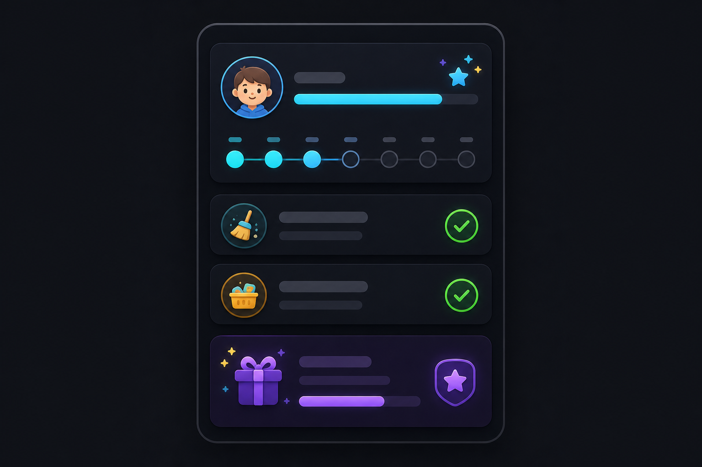

# Chores Manager Cards

Standalone Lovelace cards for the [Chores Manager](https://github.com/Caine72/ha-chores-manager) custom integration.

This project requires Chores Manager `0.3.0` or later. It does not replace the integration and it does not store household data.

> [!IMPORTANT]
> These cards are maintained for my private Home Assistant setup. It is public so it can be installed and updated through HACS as a custom repository. Bug reports are welcome, but there is no support promise, no compatibility guarantee, and no ambition to make this a general-purpose chores platform.
>
> It is also vibe coded with AI assistance. The code is intended to be practical, understandable, and reliable for my household workflow rather than polished as a broadly maintained open-source project.

## Status

Version `0.1.13` provides the production-ready child-facing daily and overview cards. The next milestone adds parent/admin audited manual adjustments and previous-week totals using the latest Chores Manager backend APIs. Dedicated history and correction cards remain later milestones.

## Installation

Install this repository as a HACS Dashboard repository and add the released JavaScript module as a Lovelace resource. For local development, build `dist/ha-chores-manager-cards.js` and register it as a JavaScript module resource.

## Daily card

```yaml
type: custom:chores-manager-daily-card
child_id: kid_1
weekly_points_entity: sensor.kid_1_weekly_points
name: Alex
person_entity: person.alex
show_header: true
show_person: true
show_points: true
locale: auto
```

The card discovers active Chores Manager switches that are visible to the current Home Assistant user. It does not need Bubble Card or a hard-coded list of entity IDs.

## Overview card

```yaml
type: custom:chores-manager-overview-card
child_id: kid_1
name: Alex
person_entity: person.alex
show_name: true
show_person: true
person_position: left
person_size: medium
show_points: true
progress_color: "#00a6d6"
rewards:
  - points: 20
    label: Friday candy
    color: "#34c759"
  - points: 30
    label: Friday candy and allowance
    color: "#ff9f0a"
buttons:
  - label: Chores
    icon: mdi:format-list-checks
    color: "#00bcd4"
    tap_action:
      action: navigate
      navigation_path: /dashboard-chores/daily
  - label: Correction
    icon: mdi:wrench-cog
    color: "#9c27b0"
    visibility:
      mode: allow-list
      users:
        - parent-user-id
    tap_action:
      action: navigate
      navigation_path: /dashboard-chores/correction
```

The visual editor provides a child-name dropdown and a separate Chores Manager weekly-points entity selector. Selecting a child automatically preselects its weekly-points sensor. `child_id` is the current YAML field; legacy `child_entity` remains supported. Reward levels define the progress targets. `progress_color` controls the bar before the first reward, while each optional reward `color` takes effect at that threshold. Colors accept `#RRGGBB` values and common Home Assistant names such as `amber`, `cyan`, and `purple`. The unfilled progress track is a darker shade of the active progress color. The expanded Points & rewards section lists the child's available chores grouped by points and the configured rewards. `goal_points` remains a compatibility fallback for older YAML and is not shown in the visual editor.

`buttons` supports up to three configurable buttons. Each button always shows a native multi-select populated with active Home Assistant users, alongside its actions and visibility mode. User selection requires an administrator account, as required by Home Assistant’s user-list API. Legacy `daily_action`, `history_action`, and `correction_action` remain supported for existing dashboards.

## Continuous integration

Pull requests must pass linting, TypeScript validation, unit tests, a production build, dependency deduplication, generated-bundle freshness, HACS validation, and the npm-lockfile guard.

## Development

Use the supplied dev container or Node 24 with Yarn 4.

```sh
corepack enable
corepack prepare yarn@4.12.0 --activate
yarn install --immutable
yarn validate
```

See [the architecture](docs/ARCHITECTURE.md), [legacy analysis](docs/LEGACY_ANALYSIS.md), and [roadmap](docs/ROADMAP.md), and [next milestone](docs/NEXT_MILESTONE.md).
