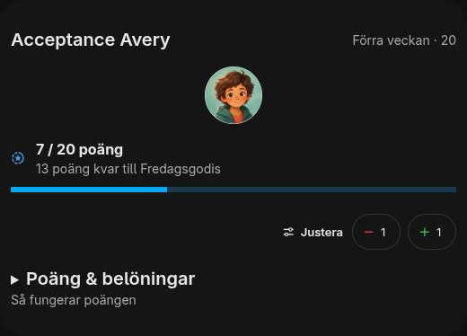
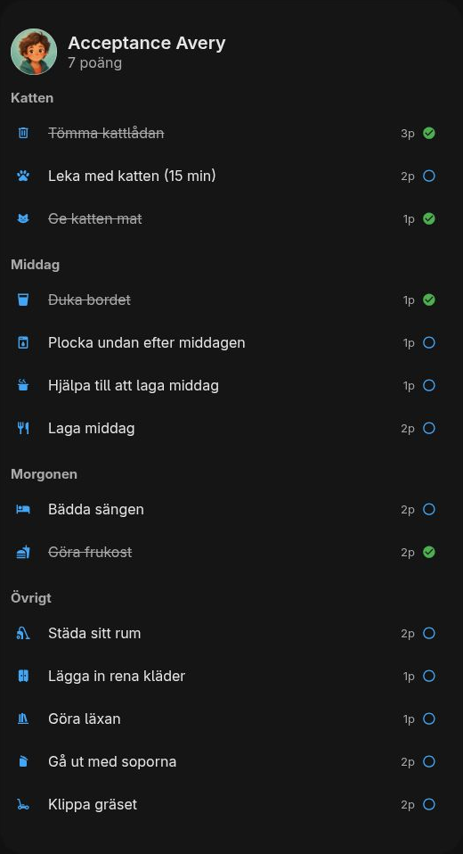
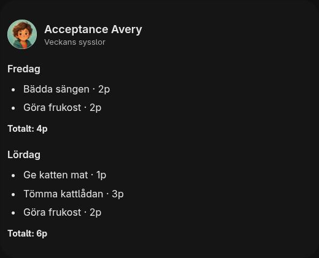
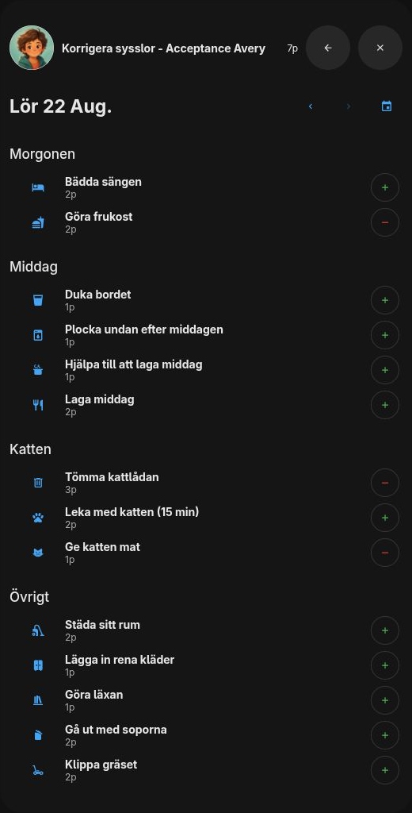

# Chores Manager Cards

Standalone Lovelace cards for the [Chores Manager](https://github.com/Caine72/ha-chores-manager) custom integration.

> [!IMPORTANT]
> These cards are maintained for a private Home Assistant setup and published primarily for HACS installation. Bug reports are welcome, but there is no support or broad compatibility promise.

Development is AI-assisted.

## Screenshots

Click a preview to open the full-size image.

| Overview | Daily chores |
| --- | --- |
|  |  |

| Current-week history | Correction |
| --- | --- |
|  |  |

## Cards

- **Daily** — grouped chores with point values and immediate completion controls.
- **Overview** — weekly progress, rewards, previous-week points, user-visible adjustments, and dashboard actions.
- **History** — completed chores grouped by day within the current chore week.
- **Correction** — administrator controls for adding or removing dated current-week completions.

All cards support visual configuration, Swedish and English presentation, border controls, and portraits from a Home Assistant Person associated with the selected child. Daily, History, and Correction can also hide their standalone headers for popup placement.

## Installation

Chores Manager `0.7.0` or newer is required.

### HACS

1. Open **HACS > Dashboard**.
2. Open the menu and select **Custom repositories**.
3. Add `https://github.com/Caine72/ha-chores-manager-cards` with the category **Dashboard**.
4. Find **Chores Manager Cards** in HACS and install the latest version.

Shared-chore claimant controls in Daily cards require Chores Manager `0.8.0` or
newer.
5. Refresh the browser.

### Manual

For a manual installation, copy `dist/ha-chores-manager-cards.js` into Home Assistant's `www` directory and register it as a JavaScript module resource.

## Configuration

Cards select a child by the stable Chores Manager `child_id`. The visual editor lists available children and matching weekly-points entities.

Display names resolve from an optional card `name`, then the integration child name. Portraits resolve from the child's associated Home Assistant Person, with an optional card-level `person_entity` override.

See the [configuration guide](docs/CONFIGURATION.md) for YAML examples, display options, rewards, actions, popup placement, and compatibility fields.

## Documentation

- [Configuration](docs/CONFIGURATION.md)
- [Architecture](docs/ARCHITECTURE.md)
- [Performance](docs/PERFORMANCE.md)
- [Migration notes](docs/LEGACY_ANALYSIS.md)
- [Roadmap](docs/ROADMAP.md)
